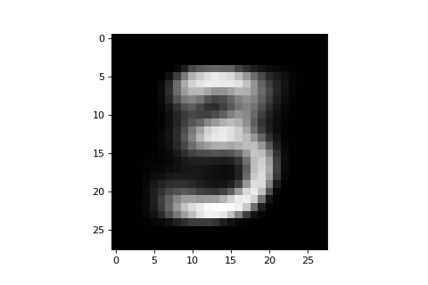

# VAE-MNIST-Animator

A couple VAE (variational autoencoder) experiments I ran on the MNIST dataset in Keras, including
animating the transition between digits in the latent encoding space.

### Experiments included:
1. Visualizing the VAE Latent Space (stolen from Keras sample script)
2. Comparing reconstructed images to original images (stolen from Keras sample script)
3. Generating new images from arbitrary encodings
4. **Animating transition between digits in the latent vector space**

### Sample Animation (3 to 0):

### Built With:
* Python 3.6 (via Anaconda)
* Keras 2.0.8 (Tensorflow backend)
* Matplotlib 2.1.0

### Sources:
* https://blog.keras.io/building-autoencoders-in-keras.html
* https://github.com/fchollet/keras/blob/master/examples/variational_autoencoder.py
